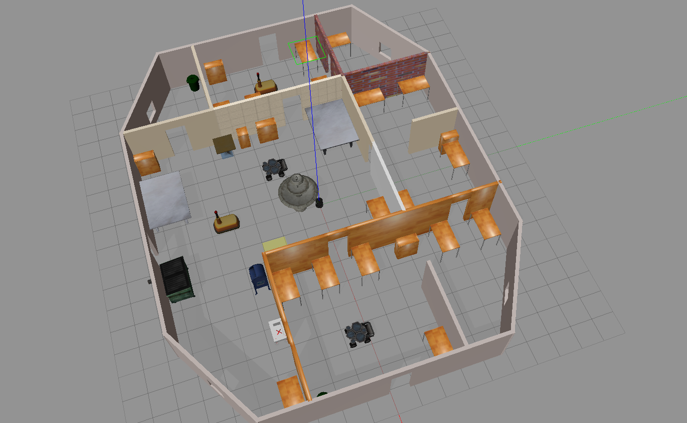
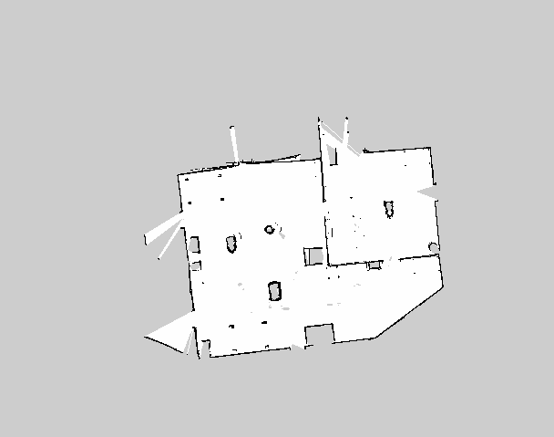
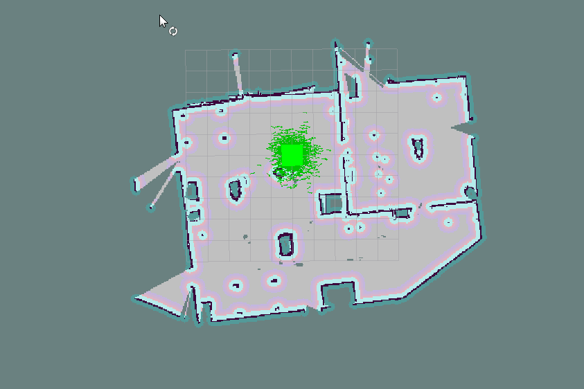

#Udacity Robotics Software Nano Degree

## Final Project: Home Service Robot

#### Problem Statement: 
Create a Robot that travels to a predefined pickup point in a map, pickup the load (simulate using virtual marker) and 
travel autonomously to a predefined drop point and simulate the load drop (virtual marker).

<!--  -->

#### Approach:
Lets break the entire problem into multiple sub-tasks and conquer them independently.
1. Mapping
2. Navigation
3. Virtual Objects, Pickup and drop
4. Integrated Home service robot

#### Packages used:

* `turtlebot_gazebo`: This provides a Gazebo simulation of the TurtleBot equipped with 2-D lidar and RGB camera .
* `turtlebot_teleop`: To manually control the TurtleBot using keyboard
* `gmapping`: Performs SLAM and can build a 2-D map of the environment. Used along with teleop to build the map of user environemnt.
* `turtlebot_rviz_launchers`: Rviz package with preconfigured settings to show the robot, map, trajectories etc.
* `AMCL`: Adaptive Monte carlo localization package, used along with generated map for localizing robot while navigation.
* `actionlib <move_base_msgs>`: Used to publish a pre-defined goal to robot.
* `visualization_msgs`: Once subscribed from Rviz, publishes virtual markers to simulate load pickup and drop.
* `odom <nav_msgs> `: Subscribed to this topic to get the current position in map and accordingly simulate load pick up / drop.

#### Methodology:

First lets build a Gazebo world and place a turtlebot in it. Let's say the image of the world shown below called: 
'_Pentagon_'. The turtlebot is located at the axis center (just below the fountain)
* Packages used: Turtlebot_gazebo

###### 1. Mapping:

For the robot to navigate in the pentagon it should be aware of all the paths and obstacles inside the world. 
So, first lets create a Map of the pentagon world which will later be used in localization and navigation.
    
    * Packages used: turtlebot_gazebo, turtlebot_teleop, gmapping, turtlebot_rviz_launchers
    
    we manually control the bot using turtlebot_teleop and move it across in the area of interest, and use gmapping to perform 
    slam and populate the appropriate 2D map. For this project we only populated the hall and one extra room as shown in the image below. 
    
    Rviz is used to visualize the map being created.

###### 2. Navigation:

Once the map is ready, we can test the bot's navigational capabilities. We use RVIZ's 2D nav goal capability to provide 
dynamic goals to the bot to navigate.

    * Packages used: turtlebot_gazebo, AMCL, turtlebot_rviz_launchers
    
    we use Adaptive Monte carlo localization (AMCL) package to localize the bot given the map, and the lidar readings.
    
    Along with AMCL we use Dijkstra's path planning algorithm to find a path between current localized position and 
    given 2D nav goal
    Rviz is used to visualize the movement of bot along with obstacle awareness and path planning. Below GIF shows the 
    entire operation for Pentagon.

###### 3. Simulating Virtual objects, pickup and Drop points:

To simulate the bot's pickup and drop capability, we generate a virtual marker in RVIZ at predefined pickup/drop points.
Let's just create a simple static virtual object (green box here) the keeps moving to pickup and drop location after every 
few seconds.

    * Packages used: turtlebot_gazebo, visualization_msgs
    
    Using visualization_msgs we create a green box in RVIZ that keeps moving to pickup and drop location 
    after every few seconds

###### 4. Final Integration:

After all the individual blocks are ready, its time for integration to achieve the requirement of Home service robot project

    * Packages used: All previous packages, actionlib, odom
    
    The map of the pentagon created is the essential input to the bot. Actionlib package is used to publish pre-defined goals to the bot. 

    After recieving the goal, the robot uses input map, AMCL and Dijkstra path planning algo to localize it self in the 
    map and obtain the approapriate path beteween the current locaiton to published goal.

    Now we modify the pickup and drop logic such that pickup should happen when the bot is with in certian area of pickup location,
    similarly the drop should happen when the bot reaches the drop location. In order to know the bot's location we use odom package.
    (Note: the virtaul object here is in blue color)

    Once all the components are integrated the final solution looks as shown in the below GIF.

